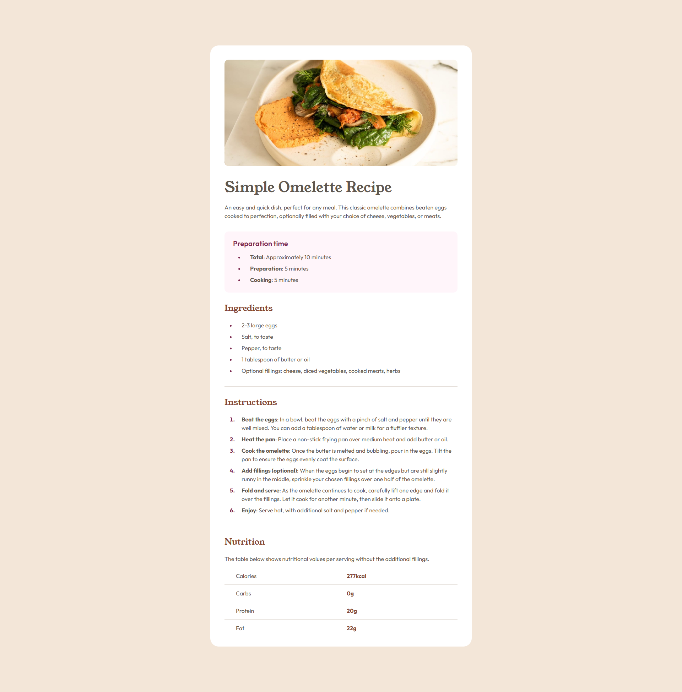

# Frontend Mentor - Recipe page solution

This is a solution to the [Recipe page challenge on Frontend Mentor](https://www.frontendmentor.io/challenges/recipe-page-KiTsR8QQKm). Frontend Mentor challenges help you improve your coding skills by building realistic projects.

## Table of contents

- [Frontend Mentor - Recipe page solution](#frontend-mentor---recipe-page-solution)
  - [Table of contents](#table-of-contents)
  - [Overview](#overview)
    - [Screenshot](#screenshot)
    - [Links](#links)
  - [My process](#my-process)
    - [Built with](#built-with)
    - [What I learned](#what-i-learned)
      - [Code Example](#code-example)
    - [Continued development](#continued-development)
    - [Useful resources](#useful-resources)
  - [Author](#author)
  - [Acknowledgments](#acknowledgments)

**Note: Delete this note and update the table of contents based on what sections you keep.**

## Overview

### Screenshot



### Links

- Solution URL: [https://github.com/jceballosdev/recipe-page.git](https://github.com/jceballosdev/recipe-page.git)
- Live Site URL: [Add live site URL here](https://your-live-site-url.com)

## My process

### Built with

- **Semantic HTML5 Markup** for accessibility and SEO
- **CSS Modules** for component-scoped styles and modularity
- **CSS Flexbox and Grid** for responsive layout
- **Atomic Design Principles** to break down UI into Atoms, Molecules, Organisms, Templates, and Pages
- [React](https://reactjs.org/) and [Typescript](https://www.typescriptlang.org/) for reusable, type-safe components
- [Vite](https://vitejs.dev/) for fast bundling and optimized development environment
- [Vitest](https://vitest.dev/) for unit testing of components

**Note: These are just examples. Delete this note and replace the list above with your own choices**

### What I learned

During this project, I strengthened my understanding of component-based architecture and accessibility best practices. Here are a few key points:

1. **Atomic Design in React:** I applied Atomic Design principles by breaking down the UI into small, reusable components (Atoms), and then assembling them into more complex structures (Molecules, Organisms).
2. **CSS Modules:** CSS Modules allowed me to scope styles to each component, avoiding naming conflicts.
3. **Accessibility Improvements:** I implemented ARIA labels, aria-describedby, and aria-labelledby attributes to make the components more accessible, ensuring that screen readers provide meaningful context.
4. **Testing Components:** I wrote unit tests using Vitest to ensure each component behaves as expected. Tests included both functionality and visual output checks.

#### Code Example

Here is an example of the `Image` component, which dynamically loads images with a fallback mechanism:

```tsx
const Image: React.FC<ImageProps> = ({ src, alt, fallbackSrc }) => {
	const [hasError, setHasError] = React.useState(false);

	const images = import.meta.glob('@/assets/images/*', { eager: true });
	const imagePath = images[`/src/assets/images/${src}`]?.default || fallbackSrc;

	return (
		 setHasError(true)}
		/>
	);
};
```

### Continued development

Moving forward, I want to:

- __Enhance Test Coverage:__ Expand tests to cover more complex interactions and edge cases in the components.
- __Explore CI/CD Further:__ Automate deployment steps with GitHub Actions and explore adding more complex build/test workflows.
- __Improve Accessibility:__ Continuously improve accessibility with more advanced ARIA roles and attributes based on best practices.

### Useful resources

- [MDN Web Docs on ARIA](https://developer.mozilla.org/en-US/docs/Web/Accessibility/ARIA) - Great resource for learning about ARIA roles and attributes for accessible web applications.
- [Atomic Design by Brad Frost](https://atomicdesign.bradfrost.com/) - This post was foundational in understanding Atomic Design.
- [Vitest Documentation](https://vitest.dev/guide/) - Vitest’s documentation was essential for setting up and writing tests for each component.

## Author

- Website - [Juan Ceballos](https://github.com/jceballosdev)
- Frontend Mentor - [@jceballos29](https://www.frontendmentor.io/profile/jceballos29)

## Acknowledgments

Special thanks to the Frontend Mentor community for feedback and suggestions, and to everyone who shared tips on Atomic Design and accessibility.
